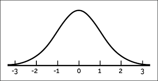
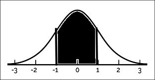

::: {.hidden}
$$
\newcommand{\expr}[3]{\begin{array}{c}
#1 \\
\bbox[lightblue,5px]{#2}
\end{array} ⊢ #3}
\newcommand{\ct}[1]{\bbox[font-size: 0.8em]{\mathsf{#1}}}
\newcommand{\updct}[1]{\ct{upd\_#1}}
\newcommand{\abbr}[1]{\bbox[transform: scale(0.95)]{\mathtt{#1}}}
\newcommand{\pure}[1]{\bbox[border: 1px solid orange]{\bbox[border: 4px solid transparent]{#1}}}
\newcommand{\return}[1]{\bbox[border: 1px solid black]{\bbox[border: 4px solid transparent]{#1}}}
\def\P{\mathtt{P}}
\def\Q{\mathtt{Q}}
\def\True{\ct{T}}
\def\False{\ct{F}}
\def\ite{\ct{if\_then\_else}}
\def\Do{\abbr{do}}
$$
:::

# A little review

---

## Motivation

Semantic frameworks provide powerful tools for characterizing what we can and cannot mean in using linguistic expressions.

::: {.fragment}
Important properties:
*compositional* and *modular*.

- Compositional:
  the meanings of complex expressions systematically computed from the meanings of smaller expressions, how they are assembled.
- Modular:
  we can analyze one linguistic phenomenon at a time (e.g., anaphora, vagueness)…
  then use a systematic recipe for putting the analyses together (e.g., anaphora *and* vagueness).
:::

---

## Prior approach #1

Challenge:
semantic frameworks don't generally provide an apparatus for characterizing *uncertainty* about what we can mean in using linguistic expressions.
 
::: {.fragment}
Result:
they have great difficulty characterizing:

- the actual inferences that a language-comprehender draws;
- the statistical patterns exhibited by these inferences (e.g., in a human inference dataset).

:::

---

## Inferential uncertainty

(@ex-magician)
The magician's assistant won't admit that they laughed during the trick.


(@ex-laugh-q)
Did the magician's assistant laugh?

---

## Inferential uncertainty

::: {.nonincremental}
(@ex-magician)
The magician's assistant won't admit that they laughed during the trick.


(@ex-laugh-q)
Did the magician's assistant laugh?
:::

{width=50px}

---

## Inferential uncertainty

::: {.nonincremental}
(@ex-magician)
The magician's assistant won't admit that they laughed during the trick.


(@ex-laugh-q)
Did the magician's assistant laugh?
:::


---

## Inferential uncertainty

::: {.nonincremental}
(@ex-magician)
The magician's assistant won't admit that they laughed during the trick.


(@ex-laugh-q)
Did the magician's assistant laugh?
:::


---

## Inferential uncertainty

::: {.nonincremental}
(@ex-magician)
The magician's assistant won't admit that they laughed during the trick.


(@ex-laugh-q)
Did the magician's assistant laugh?
:::


---

## Inferential uncertainty

::: {.nonincremental}
(@ex-magician)
The magician's assistant won't admit that they laughed during the trick.


(@ex-laugh-q)
Did the magician's assistant laugh?
:::


Average response:


---

## Inferential uncertainty

::: {.nonincremental}
(@ex-magician)
The magician's assistant won't admit that they laughed during the trick.


(@ex-laugh-q)
Did the magician's assistant laugh?
:::


Average response:


---


## Prior approach #2

Frameworks for probabilistic semantics and pragmatics provide powerful tools for characterizing [uncertainty]{.gb-orange} about what we can mean in using linguistics expressions: 

- sampling from and querying arbitrary probability distributions 
- relating the output to (e.g., human) data 
- formal model comparison
  
::: {.fragment}
Challenge:
no general structure-preserving method for mapping between semantic analyses and probabilistic analyses.
:::

---

## "Probabilistic Dynamic Semantics"

Goal:
framework where probabilistic reasoning can be [added]{.gb-orange} to a semantic analysis without changing its structure.

::: {.fragment}
Result:

- characterize and distinguish difference sources of uncertainty 
- use *existing semantic theories* by plugging them into the framework 
- formally compare different semantic theories with each other

:::

---

## A general goal

- Have a methodology that is widely available to linguists working on meaning.

::: {.fragment}
Large-scale inference datasets are becoming more and more central to linguistic methodology, and semantic theory should keep up! 

- Tools to render semantic theories as probabilistic models can help catalyze things.
:::

---

## The basic idea

We should think of an experimental trial as a little discourse.
  
<br>
<div style="text-align: center;">

</div>
  
---

## The basic idea
  
- [Sentences:]{.gb-orange}
  Start with a prior distribution over parameters some kind (e.g., encoding world knowledge, basic meanings). 
  Update this prior with $⟦\textit{s1}⟧$, then $⟦\textit{s2}⟧$, etc. 
- [Question:]{.gb-orange}
  Add $⟦\textit{q}⟧$ to the stack of questions under discussion [@ginzburg_dynamics_1996; @farkas_reacting_2010]. 
- [Answer:]{.gb-orange}
  Retrieve $⟦\textit{q}⟧$ from the question stack;
  respond (i.e., query an inference distribution).

---

## Upshot

  Once we have modeled the entire discourse in terms of some semantic analysis, we end up with [a distribution over answers to the question prompt]{.gb-orange}.
  
- A distribution we can learn about from data.

---

## Two kinds of uncertainty

- [resolved]{.gb-orange} (or *type-level*) uncertainty
  - lexical, structural, or semantic (e.g., scopal) ambiguity
- [unresolved]{.gb-orange} (or *token-level*) uncertainty
  - present on individual occasions of language use

---

## Example of resolved uncertainty

(@ex-run-sketch) Jo ran a race.

<br>

- locomotion sense of *ran*
- management/organizational sense of *ran*

::: {.fragment}
About nature of speech act.
:::

---

## Example of unresolved uncertainty

(@ex-tall-sketch) Jo is tall.

<br>

- uncertainty about Jo's height

::: {.fragment}
In some sense, independent of speech act.
:::

---

## Uncertainty in PDS

- Probability distributions may be "stacked"; this stacking is reflected in the *types* of semantic values.
  - E.g., $\P e$ vs. $\P (\P e)$.
- Resolved uncertainty: about the *state* of some discourse.
  - $\P σ$
- Unresolved uncertainty: encoded in the *common ground*.
  - $\P ι$ ($ι$ the type of possible worlds)
  - The common ground is an aspect of the state! $\P σ = \P (… \P ι …)$

---

## Discourse states

- Lists of parameters - can be arbitrarily complex.
  - The common ground (or context set; @stalnaker_assertion_1978)
  - The question under discussion [@roberts_information_2012;@ginzburg_dynamics_1996]
  - @farkas_reacting_2010 stuff (e.g., projected sets)
  - (Whatever you want)

---

## Common grounds

- Probability distributions over indices of some type
  - encode what is true "in the world" <br> 
  - maybe certain linguistic parameters

::: {.fragment}
### States vs. indices of the common ground

What kind of thing goes where?

- Ultimately, an empirical question.
:::

---

## Dynamic semantics

(@ex-indef-pronoun) Some linguist walked in. They gave a lecture.

::: {.fragment}
### Popular idea
Many frameworks for dynamic semantics model sentence meanings as maps from input states to sets of output states [e.g., @groenendijk_dynamic_1991;@muskens_combining_1996, i.a.].
:::


::: {.fragment}
- 1st sentence: $λs.\{ x{::}s^{\prime} ∣ s^{\prime} = s ∧ \ct{ling}(x) ∧ \ct{walk}(x)\}$
- 2nd sentence: $λs.\{ s^{\prime} ∣ s^{\prime} = s ∧ \ct{lecture}(\ct{sel}(s))\}$
:::

---

## Expressions and discourses

- map discourse states onto probability distributions over new discourse states: $σ → \P (α × σ^{\prime})$
- complex linguistic acts may be *sequenced*
  - an operation, *bind*, native to the probability monad

::: {.fragment}

### For instance

- $\abbr{assert}(⟦\textit{Jo is tall}⟧) : σ → \P (⋄ × σ)$
- $\abbr{ask}(⟦\textit{how tall?}⟧) : σ → \P (⋄ × \Q ι r σ)$
- $\abbr{assert}(⟦\textit{Jo is tall}⟧) >> \abbr{ask}(⟦\textit{how tall?}⟧) : σ → \P (⋄ × \Q ι r σ)$
:::

---

## Response functions/linking models

- Take a discourse, together with a prior distribution over states…
- Give back a distribution over responses to the last question asked (given some testing instrument).

::: {.fragment}
$$
\begin{align*}
\ct{respond} &: \P σ → (σ → \P (⋄ × \Q ι α σ^{\prime})) → \P ρ
\end{align*}
$$
:::

---

## Examples of linking models

$$
\begin{align*}
\ct{respond} &: \P σ → (σ → \P (⋄ × \Q ι α σ^{\prime})) → \P ρ
\end{align*}
$$

- Likert scale (categorical distribution);<br>
  e.g., $ρ = \{\textit{yes}, \textit{maybe}, \textit{no}\}$
- Slider scale (truncated normal distribution); <br>
  $ρ = r$
- Binary forced choice (Bernoulli distribution); <br>
  $ρ = t$

---

# Syntax, meaning, compositionality

---

## CCG

### Atomic types
$$
\begin{align*}
\mathcal{A} &\Coloneqq np ∣ n ∣ s ∣\,\,...
\end{align*}
$$
Noun phrases ($np$), nouns ($n$), and sentences ($s$).

::: {.fragment}
### Complex types
$$
\begin{align*}
\mathcal{C}_{\mathcal{A}} &\Coloneqq \mathcal{A} ∣ \mathcal{C}_{\mathcal{A}}/\mathcal{C}_{\mathcal{A}} ∣ \mathcal{C}_{\mathcal{A}}\backslash\mathcal{C}_{\mathcal{A}}
\end{align*}
$$

<!-- E.g., $s/np, s\backslash np, np/n, (np\backslash n)/ np, (s\backslash s)/s$ -->
:::

--- 

## Haskell

<br><br>

``` haskell
data Cat = Base String  -- atomic categories
         | Cat :/: Cat  -- the forward slash
         | Cat :\: Cat  -- the backward slash
  deriving (Eq)
```

---

## CCG expressions

An expression:

$$\Large
\begin{align*}
  \expr{\textit{dog}}{λx, i.\ct{dog}(i)(x)}{n}
\end{align*}
$$

- $\textit{dog}$ is a string.
- $λx, i.\ct{dog}(i)(x)$ is a meaning (reprented in the λ-calculus).
  - Its type is $e → ι → t$.
- $n$ is a CCG category.

---

## Semantic types (in detail)

::: {.fragment}
### Atomic types

$$
\begin{align*}
A \Coloneqq e ∣ t ∣\,\,...
\end{align*}
$$
:::

::: {.fragment}
### Complex types

$$
\begin{align*}
   \mathcal{T}_{A} \Coloneqq A ∣ \mathcal{T}_{A} → \mathcal{T}_{A} ∣ \mathcal{T}_{A} × \mathcal{T}_{A} ∣ ⋄
\end{align*}
$$
:::

---

## Haskell

```haskell
data Type = Atom String  -- atomic types
          | Type :→ Type -- arrows
          | Unit         -- unit type
          | Type :× Type -- products
          | TyVar String -- type variables
  deriving (Eq)
```

- Note the type variables!

---

<!-- ## Hindley-Milner style polymorphism -->

<!-- ::: {.fragment} -->
<!-- Good: -->

<!-- - $λx^{α}.x^{α} : α → α$ \ \  🥰 -->
<!-- - $λx^{α → β}, y^{α}.x(y)^{β} : (α → β) → α → β$ \ \  🥰 -->
<!-- ::: -->

<!-- ::: {.fragment} -->
<!-- Bad: -->

<!-- - $λf^{α → t}.f(λy^{β}.y^{β}) ∧ f(λx^{β}, y^{γ}.x^{γ})$ \ \  🙁 -->
<!-- ::: -->

<!-- --- -->

## Typing rules

<br>
$$ \scriptsize
\begin{array}{c}
\begin{prooftree}
\AxiomC{}
\RightLabel{$\mathtt{Ax}$}\UnaryInfC{$Γ, x : α ⊢ x : α$}
\end{prooftree}
& \begin{prooftree}
\AxiomC{$Γ, x : α ⊢ t : β$}
\RightLabel{${→}\mathtt{I}$}\UnaryInfC{$Γ ⊢ λx.t : α → β$}
\end{prooftree}
& \begin{prooftree}
\AxiomC{$Γ ⊢ t : α → β$}
\AxiomC{$Γ ⊢ u : α$}
\RightLabel{${→}\mathtt{E}$}\BinaryInfC{$Γ ⊢ t(u) : β$}
\end{prooftree} \\[2mm]
\begin{prooftree}
\AxiomC{}
\RightLabel{$⋄\mathtt{I}$}\UnaryInfC{$Γ ⊢ ⋄ : ⋄$}
\end{prooftree}
& \begin{prooftree}
\AxiomC{$Γ ⊢ t : α$}
\AxiomC{$Γ ⊢ u : β$}
\RightLabel{$×\mathtt{I}$}\BinaryInfC{$Γ ⊢ ⟨t, u⟩ : α × β$}
\end{prooftree}
& \begin{prooftree}
\AxiomC{$Γ ⊢ t : α_1 × α_2$}
\RightLabel{$×\mathtt{E}_{j}$}\UnaryInfC{$Γ ⊢ π_{j}(t) : α_{j}$}
\end{prooftree}
\end{array}
$$

---

## Typing rules

### $→\mathtt{E}$

<br>
$$
\begin{prooftree}
\AxiomC{$Γ ⊢ t : α → β$}
\AxiomC{$Γ ⊢ u : α$}
\RightLabel{${→}\mathtt{E}$}\BinaryInfC{$Γ ⊢ t(u) : β$}
\end{prooftree}
$$

---

## Haskell: vanilla terms

```haskell
-- | Untyped λ-terms. Types are assigned separately (i.e., "extrinsically").
data Term = Var VarName           -- Variables.
          | Con Constant          -- Constants.
          | Lam VarName Term      -- Abstractions.
          | App Term Term         -- Applications.
          | TT                    -- The 0-tuple.
          | Pair Term Term        -- Pairing.
          | Pi1 Term              -- First projection.
          | Pi2 Term              -- Second projection.
```
::: {.fragment}
Constants:

```haskell
-- | Constants are indexed by either strings or real numbers.
type Constant = Either String Double
```
:::

---

## Deriving meanings

::: {.fragment}
### Type homomorphism

- $\small ⟦np⟧ = e \hspace{2cm} ⟦n⟧ = e → ι → t \hspace{2cm} ⟦s⟧ = ι → t$ <br>
- $\small ⟦b / a⟧ = ⟦b \backslash a⟧ = ⟦a⟧ → ⟦b⟧$
:::

::: {.fragment}
### Example: application

(@ex-every-linguist)
$$\scriptsize
\frac{\expr{\textit{every}}{λp^{e → ι → t}, q^{e → ι → t}, i^{ι}.(∀y.p(y)(i) → q(y)(i))^{t}}{s}/(s\backslash np)/ n \hspace{1cm} \expr{\textit{linguist}}{λx^{e}, i^{ι}.(\ct{ling}(i)(x))^{t}}{n}}{
\expr{\textit{every linguist}}{λq^{e → ι → t}, i^{ι}.(∀y.\ct{ling}(i)(y) → q(y)(i))^{t}}{s}/(s\backslash np)
}>
$$
:::

---

### Example: composition

(@ex-every-linguist-saw)
$$ \scriptsize
\frac{\expr{\textit{every linguist}}{λq^{e → ι → t}, i^{ι}.(∀y.\ct{ling}(i)(y) → q(y)(i))^{t}}{s}/ (s\backslash np)
\hspace{1cm}
\expr{\textit{saw}}{λx^{e}, y^{e}, i^{ι}.(\ct{see}(i)(x)(y))^{t}}{s}\backslash np/ np}{
\expr{\textit{every linguist saw}}{λx^{e}, i^{ι}.(∀y.\ct{ling}(i)(y) → \ct{see}(i)(x)(y))^{t}}{s}/ np
}{>}\textbf{B}
$$

---

## Adding probabilistic types

::: {.fragment}
### New atomic types

$$
A \Coloneqq e ∣ t ∣ r ∣\,\,...
$$
:::

::: {.fragment}
### New complex types

$$
\mathcal{T}_{A} \Coloneqq A ∣ \mathcal{T}_{A} → \mathcal{T}_{A} ∣ \mathcal{T}_{A} × \mathcal{T}_{A} ∣ ⋄ ∣ \P \mathcal{T}_{A}
$$

- $\P t$: a Bernoulli distribution---probabilistically True or False.
- $\P r$: e.g., a normal distribution.

:::

---

## Haskell

```haskell
data Type = Atom String  -- atomic types
          | Type :→ Type -- arrows
          | Unit         -- unit type
          | Type :× Type -- products
          | P Type       -- probabilistic types
          | TyVar String -- type variables
  deriving (Eq)
```

---

## Probabilistic typing rules

<br><br>
$$
\begin{array}{c}
\begin{prooftree}
\AxiomC{$Γ ⊢ t : α$}
\RightLabel{$\mathtt{Return}$}\UnaryInfC{$Γ ⊢ \pure{t} : \P α$}
\end{prooftree}
& \begin{prooftree}
\AxiomC{$Γ ⊢ t : \P α$}
\AxiomC{$Γ, x : α ⊢ u : \P β$}
\RightLabel{$\mathtt{Bind}$}\BinaryInfC{$Γ ⊢ \left(\begin{array}{l} x ∼ t \\ u\end{array}\right) : \P β$}
\end{prooftree}
\end{array}
$$

---

## Haskell: probabilistic programs

```haskell
-- | Untyped λ-terms. Types are assigned separately (i.e., "extrinsically").
data Term = Var VarName           -- Variables.
          | Con Constant          -- Constants.
          | Lam VarName Term      -- Abstractions.
          | App Term Term         -- Applications.
          | TT                    -- The 0-tuple.
          | Pair Term Term        -- Pairing.
          | Pi1 Term              -- First projection.
          | Pi2 Term              -- Second projection.
          | Return Term           -- Construct a degenerate distribution.
          | Let VarName Term Term -- Sample from a distribution and continue.
```

- `Let x t u` \ \ \ =\ \ \ 
  $\begin{array}[t]{l}
  x ∼ t \\
  u
  \end{array}$
- `Return t` \ \ \ = \ \ \ $\pure{t}$


---

<!-- ## The probability monad -->

<!-- $$\small -->
<!-- \begin{array}{c} -->
<!-- \textit{Left identity} & \textit{Right identity} & \textit{Associativity} \\[1mm] -->
<!-- \begin{array}{l} -->
<!-- x ∼ \pure{v} \\ -->
<!-- k -->
<!-- \end{array}\ \ =\ \ k[v/x]  -->
<!-- & \begin{array}{l} -->
<!-- x ∼ m \\ -->
<!-- \pure{x} -->
<!-- \end{array}\ \ =\ \ m  -->
<!-- & \begin{array}{l} -->
<!-- y ∼ \left(\begin{array}{l} -->
<!-- x ∼ m \\ -->
<!-- n -->
<!-- \end{array}\right) \\ -->
<!-- o -->
<!-- \end{array}\ \ =\ \ \begin{array}{l} -->
<!-- x ∼ m \\ -->
<!-- y ∼ n \\ -->
<!-- o -->
<!-- \end{array} -->
<!-- \end{array} -->
<!-- $$ -->

<!-- ::: {.fragment} -->

<!-- ### Example (associativity) -->

<!-- $$ -->
<!-- \begin{array}{l} -->
<!-- y ∼ \left(\begin{array}{l} -->
<!-- x ∼ \abbr{Normal}(0, 1) \\ -->
<!-- \abbr{Normal}(x, 1) -->
<!-- \end{array}\right) \\ -->
<!-- o -->
<!-- \end{array} \ \ =\ \  -->
<!-- \begin{array}{l} -->
<!-- x ∼ \abbr{Normal}(0, 1) \\ -->
<!-- y ∼ \abbr{Normal}(x, 1) \\ -->
<!-- o -->
<!-- \end{array} -->
<!-- $$ -->

<!-- ::: -->

<!-- --- -->

---

### Mother

$$
\begin{array}[t]{l}
x ∼ \ct{mammal}\\
\pure{\ct{mother}(x)}
\end{array}
$$

- Some distribution $\ct{mammal} : \P e$
- Some function $\ct{mother} : e → e$.
- What is the type of the whole expression?

---

## Making observations

$$
\begin{align*}
\ct{observe}\ \ &:\ \ t → \P ⋄ \\
\end{align*}
$$

::: {.fragment}
$$
\begin{array}[t]{l}
x ∼ \ct{Normal}(0, 1) \\
\ct{observe}(-1 ≤ x ≤ 1) \\
\pure{x}
\end{array}
$$
:::

:::{.fragment}
{fig-align="center" width=500}
:::

---

## Making observations

$$
\begin{align*}
\ct{observe}\ \ &:\ \ t → \P ⋄ \\
\end{align*}
$$

$$
\begin{array}[t]{l}
x ∼ \ct{Normal}(0, 1) \\
\ct{observe}(-1 ≤ x ≤ 1) \\
\pure{x}
\end{array}
$$

{fig-align="center" width=500}

---

### More mammals

$$
\begin{array}[t]{l}
x ∼ \ct{mammal} \\
\ct{observe}(\ct{dog}(x)) \\
\ct{observe}(\ct{friendly}(x)) \\
\pure{\ct{father}(x)}
\end{array}
$$

- $\ct{dog}, \ct{friendly} : e → t$
- $\ct{father} : e → e$
- What distribution is this?

---

### Bad Bernoulli

$$
\ct{Bernoulli} : r → \P t
$$

<br>

::: {.fragment}
$$
\begin{array}[t]{l}
b ∼ \ct{Bernoulli}(0.5) \\
\ct{observe}(b) \\
\pure{b}
\end{array}
$$

- What distribution is this?
:::

---

## Haskell: typing constants

```haskell
-- | Assign types to constants.
type Sig = Constant -> Maybe Type
```
<br>

::: {.fragment}

### An example signature

```haskell
e, t, r :: Type
e = At E
t = At T
r = At R

tau :: Sig
tau = \case
  Left  "observe"   -> Just (t :→ P Unit)
  Left  "Normal"    -> Just (r :× r → P r)
  Left  "Bernoulli" -> Just (r :→ P t)
  Left  "mother"    -> Just (e :→ e)
  Right _           -> Just r
```
:::

---

## Types of expressions

$$\Large
σ → \P (α × σ^{\prime})
$$

::: {.fragment}
$α$ could be:

- $e → ι → t \hspace{2cm}$ (a predicate meaning)
- $e \hspace{7cm}$ (a np meaning)
- etc.
:::

---

## An interface for meaning composition

$$
\begin{align*}
ℙ^{σ}_{σ^{\prime}} α\ \ &=\ \ σ → \P (α × σ^{\prime})
\end{align*}
$$

::: {.fragment}
$$
\begin{align*}
\return{v}\ \ &=\ \ λs.\pure{⟨v, s⟩} : ℙ^{σ}_{σ}
\end{align*}
$$
:::

::: {.fragment}
$$
\begin{align*}
\begin{array}{rl}
\Do & x ← m : ℙ^{σ}_{σ^{\prime}} \\
& k(x) : ℙ^{σ^{\prime}}_{σ^{\prime\prime}}
\end{array}\ \ 
&=\ \ λs.\left(\begin{array}{l}
⟨x, s^{\prime}⟩ ∼ m(s) \\
k(x)(s^{\prime})
\end{array}\right) : ℙ^{σ}_{σ^{\prime\prime}}
\end{align*}
$$
:::

---

## Types of expressions

(@ex-jo-ran) Jo ran a race.

::: {.fragment}
$⟦\textit{run}⟧ : ℙ^{σ}_{σ} (e → ι → t)$
:::

::: {.fragment}
$$
\expr{\textit{run}}{λs.\pure{⟨λx, i.\ct{if\_then\_else}(τ_{\textit{run}}(s))(\ct{run}_{loc.}(i)(x), \ct{run}_{org.}(i)(x)), s⟩}}{s \backslash np}
$$
:::

- Depends on the state.
- Doesn't update it.
- Not very probabilistic.

---

## PDS Rules

### Example: leftward application

$$
\begin{prooftree}
\AxiomC{$\expr{s_{1}}{M_{1}}{b}$}
\AxiomC{$\expr{s_{2}}{M_{2}}{c\backslash b}$}
\RightLabel{$<$}\BinaryInfC{$\expr{s_{1}\,s_{2}}{
\begin{array}{rl}
\Do & m_{1} ← M_{1} \\
& m_{2} ← M_{2}; \\
& \return{m_{2}(m_{1})}
\end{array}
}{c}$}
\end{prooftree}
$$

---

## A sentence meaning

(@ex-linguist-philosopher) A linguist saw a philosopher.

::: {.fragment}
$$\tiny\hspace{-6cm}
\begin{prooftree}
\AxiomC{$\expr{\textit{a ling.}}{λs.\pure{⟨λi, k.∃x.\ct{ling}(i)(x) ∧ k(i)(x), s⟩}}{s/(s\backslash np)}$}
\AxiomC{$\expr{\textit{saw}}{λs.\pure{⟨λi, y, x.\ct{see}(i)(y)(x), s⟩}}{s\backslash np/ np}$}
\AxiomC{$\expr{\textit{a phil.}}{λs.\pure{⟨λi, k, x.∃y.\ct{phil}(i)(y) ∧ k(i)(y)(x), s⟩}}{s\backslash np/(s\backslash np/np)}$}
\RightLabel{$<$}\BinaryInfC{$\expr{\textit{saw a phil.}}{λs.\pure{⟨λx, i.∃y.\ct{phil}(i)(y) ∧ \ct{see}(i)(y)(x), s⟩}}{s \backslash np}$}
\RightLabel{$<$}\BinaryInfC{$\expr{\textit{a linguist saw a philosopher}}{λs.\pure{⟨λi.∃x, y.\ct{ling}(i)(x) ∧ \ct{phil}(i)(y) ∧ \ct{see}(i)(y)(x), s⟩}}{s}$}
\end{prooftree}
$$
:::

---

## A sentence meaning

<br>

$$
\expr{\textit{a linguist saw a philosopher}}{λs.\pure{⟨λi.∃x, y.\ct{ling}(i)(x) ∧ \ct{phil}(i)(y) ∧ \ct{see}(i)(y)(x), s⟩}}{s}
$$

---

## Intensionality

Intensional constants:

$$
\begin{align*}
\ct{see} &: ι → e → e → t \\
\ct{ling} &: ι → e → t
\end{align*}
$$

::: {.fragment}

We require other constants:

$$
\begin{align*}
\updct{see} &: (e → e → t) → ι → ι \\
\updct{ling} &: (e → t) → ι → ι 
\end{align*}
$$

:::

---

## How intensional constants interact

::: {.fragment}
$$
\ct{see}(\updct{see}(p)(i)) = p \\
$$
:::

::: {.fragment}
$$
\ct{see}(\updct{ling}(p)(i)) = \ct{see}(i)
$$
:::

::: {.fragment}
$$
\ct{ling}(\updct{ling}(p)(i)) = p \\
$$
:::

::: {.fragment}
$$
\ct{ling}(\updct{see}(p)(i)) = \ct{ling}(i)
$$

- Can be seen as a theory of states and locations.
  - Indices are "states".
  - (Pairs of) constants correspond to "locations".
  
:::

---

## The common ground

### Definition

A *common ground* is a probabilistic program of type $\P ι$.

- $ι$, a variable over types.

::: {.fragment}
### A "starting" index

$$\ct{@} : ι$$

- Constants that *update* indices can add information, to be later retrieved by intensional constants.

:::

---

### An example common ground

$$\small
\begin{array}[t]{l}
h ∼ \abbr{Normal}(0, 1) \\
\pure{\updct{height}(λx.h)(\ct{@})}
\end{array}
$$

- Encodes uncertainty about Jo's height.

::: {.fragment}

### Another one

$$\scriptsize
\begin{array}[t]{l}
h_{j} ∼ \abbr{Normal}(0, 1) \\
h_{b} ∼ \abbr{Normal}(0, 1) \\
\pure{\updct{height}(λx.\ite(x = \ct{j}, h_{j}, h_{b}))(\ct{@})}
\end{array}
$$

- Encodes uncertainty about Jo's height and Bo's height.
:::

---

## States

Some state-sensitive constants:

::: {.fragment}
$$
\ct{CG} : σ → \P ι \\
$$
:::

::: {.fragment}
$$
\updct{CG} : \P ι → σ → σ \\
$$
:::

::: {.fragment}
$$
\ct{QUD} : \Q ι α σ → α → ι → t
$$
:::

::: {.fragment}
$$
\updct{QUD} : (α → ι → t) → σ → \Q ι α σ 
$$
:::

---

## Haskell: the $\Q$ constructor

<br><br>
```haskell
-- | Arrows, products, and probabilistic types, as well as (a) abstract types
-- representing the addition of a new Q, and (b) type variables for encoding
-- polymorphism.
data Type = At Atom
          | Type :→ Type
          | Unit
          | Type :× Type
          | P Type
          | Q Type Type Type
          | TyVar String
  deriving (Eq)
```

---

## How stateful constants interact

$$
\ct{CG}(\updct{CG}(cg)(s)) = cg
$$

<!-- ::: {.fragment} -->
<!-- $$ -->
<!-- \ct{CG}(\updct{QUD}(q)(s)) = \ct{CG}(s) -->
<!-- $$ -->
<!-- ::: -->

<!-- ::: {.fragment} -->
<!-- $$ -->
<!-- \ct{QUD}(\updct{QUD}(q)(s)) = q \\ -->
<!-- $$ -->
<!-- ::: -->

<!-- ::: {.fragment} -->
<!-- $$ -->
<!-- \ct{QUD}(\updct{CG}(cg)(s)) = \ct{QUD}(s) -->
<!-- $$ -->
<!-- ::: -->

---

## Manipulating stateful programs

### $\ct{get}$ and $\ct{put}$

$$
\begin{align*}
\abbr{get} &: ℙ^{σ}_{σ} σ
\end{align*}
$$

- Gets the current state.

::: {.fragment}
$$
\begin{align*}
\abbr{put} &: σ^{\prime} → ℙ^{σ}_{σ^{\prime}} ⋄ \\
\end{align*}
$$

- Overwrites the current state with a new one.

:::

---

## Haskell

<br><br>
```haskell
getPP :: Term
getPP = lam' s (Return (s & s))

putPP :: Term -> Term
putPP s = Lam fr (Return (TT & s))
  where fr:esh = fresh [s]
```

---

### Making an assertion

$$
\begin{align*}
\abbr{assert} &: ℙ^{σ}_{σ^{\prime}} (ι → t) → ℙ^{σ}_{σ^{\prime}} ⋄
\end{align*}
$$

::: {.fragment}
$$
\begin{align*}
\abbr{assert}(⟦\textit{Jo is tall}⟧) &= \begin{array}[t]{rl}
\Do & p^{ι → t} ← ⟦\textit{Jo is tall}⟧^{ℙ^{σ}_{σ} (ι → t)} \\
& s ← \abbr{get} \\
& c ← \return{\ct{CG}(s)} \\
& c^{\prime} ← \return{\left(\begin{array}{l}
i ∼ c \\
\ct{observe}(p(i)) \\
\pure{i}
\end{array}\right)} \\
& \abbr{put}(\updct{CG}(c^{\prime})(s))
\end{array}
\end{align*}
$$
:::

---

## Asking a question

$$
\begin{align*}
\abbr{ask} &: ℙ^{σ}_{σ^{\prime}} (α → ι → t) → ℙ^{σ}_{\Q ι α σ^{\prime}} ⋄
\end{align*}
$$

::: {.fragment}
$$
\begin{align*}
\abbr{ask}(⟦\textit{how tall?}⟧) &= \begin{array}[t]{rl}
\Do & q^{r → ι → t} ← ⟦\textit{how tall?}⟧^{ℙ^{σ}_{σ}(r → ι → t)} \\
& s ← \abbr{get} \\
& \abbr{put}(\updct{QUD}(q)(s))
\end{array}
\end{align*}
$$
:::

---

## Responding to a question

<br><br>

$$
\begin{align*}
\abbr{respond}^{f_Φ : r → \P ρ} &: \P σ → ℙ^{σ}_{\Q ι r σ^{\prime}} ⋄ → \P ρ
\end{align*}
$$

---

## Responding to a question

$$
\begin{align*}
&\abbr{respond}^{f_Φ : r → \P ρ}(prior)(discourse) \\[5mm]
&= \begin{array}[t]{l}
s ∼ prior \\
⟨⋄, s^{\prime}⟩ ∼ discourse(s)\\
i ∼ \ct{CG}(s^{\prime}) \\
f(\ct{max}(λd.\ct{QUD}(s^{\prime})(d)(i)), Φ)
\end{array}
\end{align*}
$$

- Example $f_{Φ}$
  - $f(x, Φ) = \ct{Normal}(x, 1)$

---

## A probabilistic model

$$
\begin{align*}
\abbr{respond}^{f_Φ : r → \P ρ} &: \P σ → ℙ^{σ}_{\Q ι r σ^{\prime}} ⋄ → \P ρ
\end{align*}
$$

$$
\abbr{respond}^{λx.\ct{Normal}(x, 1)}(prior)\left(
\begin{array}{rl}
\Do & \abbr{assert}(⟦\textit{Jo is tall}⟧) \\
& \abbr{ask}(⟦\textit{how tall?}⟧)
\end{array}
\right)
$$

---

## How do we actually compute this stuff?

<br>

::: {.fragment}
Delta-rules.

```haskell
-- | The type of Delta-rules.
type DeltaRule = Term -> Maybe Term
```
:::

--- 

### Indices

```haskell
-- | Computes functions on indices.
indices :: DeltaRule
indices = \case
  Ling   (UpdLing   p _) -> Just p
  Ling   (UpdSocPla _ i) -> Just (Ling i)
  SocPla (UpdSocPla p _) -> Just p
  SocPla (UpdLing   _ i) -> Just (SocPla i)
  _                      -> Nothing
```

::: {.fragment}
### States

```haskell
-- | Computes functions on states.
states :: DeltaRule
states = \case
  CG      (UpdCG      cg _) -> Just cg
  CG      (UpdTauKnow _  s) -> Just (CG s)
  TauKnow (UpdTauKnow b  _) -> Just b
  TauKnow (UpdCG      _  s) -> Just (TauKnow s)
  _                         -> Nothing
```
:::

---

### If then else

```haskell
-- | Computes /if then else/.
ite :: DeltaRule
ite = \case
  ITE Tr x y -> Just x
  ITE Fa x y -> Just y
  _          -> Nothing
```

---

### Making observations

```haskell
-- | Observing @Tr@ is trivial, while observing @Fa@ yields an undefined
-- probability distribution.
observations :: DeltaRule
observations = \case
  Let _ (Observe Tr) k -> Just k
  Let _ (Observe Fa) k -> Just Undefined
  _                    -> Nothing
```

---

## Summing up

- We have a computational framework for:
  - encoding grammar fragments
  - representing speech acts (assertions, questions)
  - representing theories linking inferences to behavior (as response functions)
  - computing with the resulting probabilistic programs (via delta-rules)

---

### Note

- Delta-rules are in principle open ended!
  - You just need to show that they're sound.
  - Might incorporate more sophisticated means of simplifying representations of probability distributions.
  - Might incorporate theorem provers (e.g., if there are FOL representations).

---

### References
